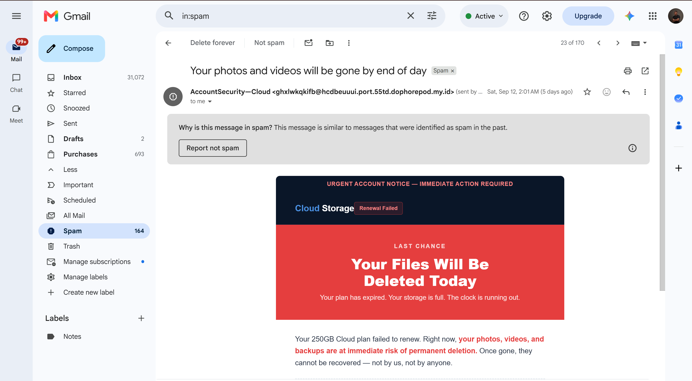
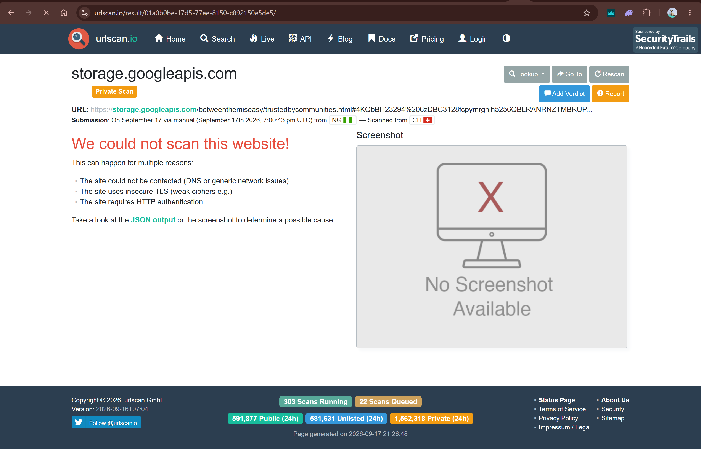
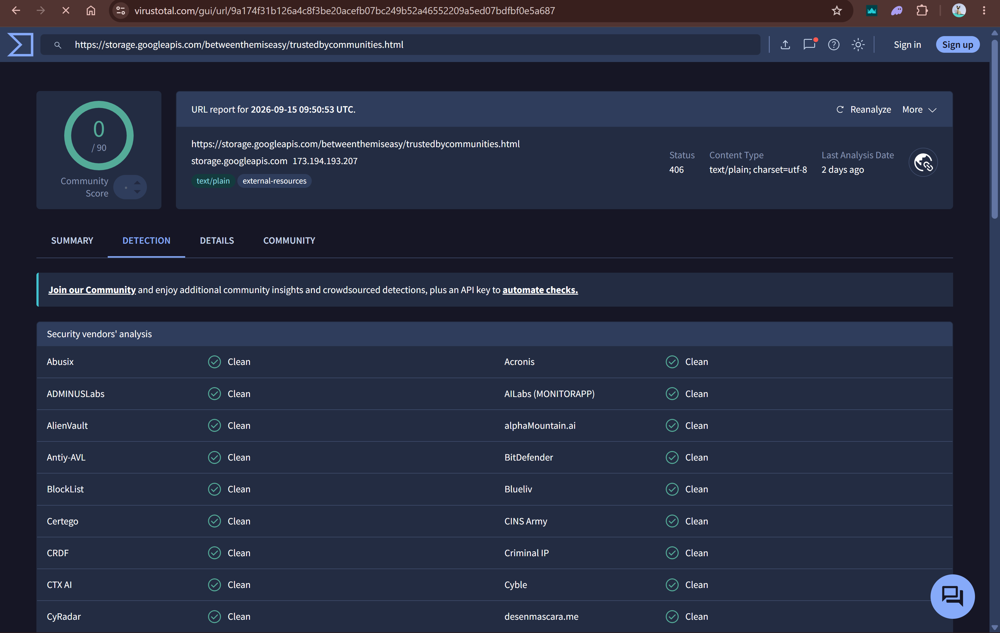
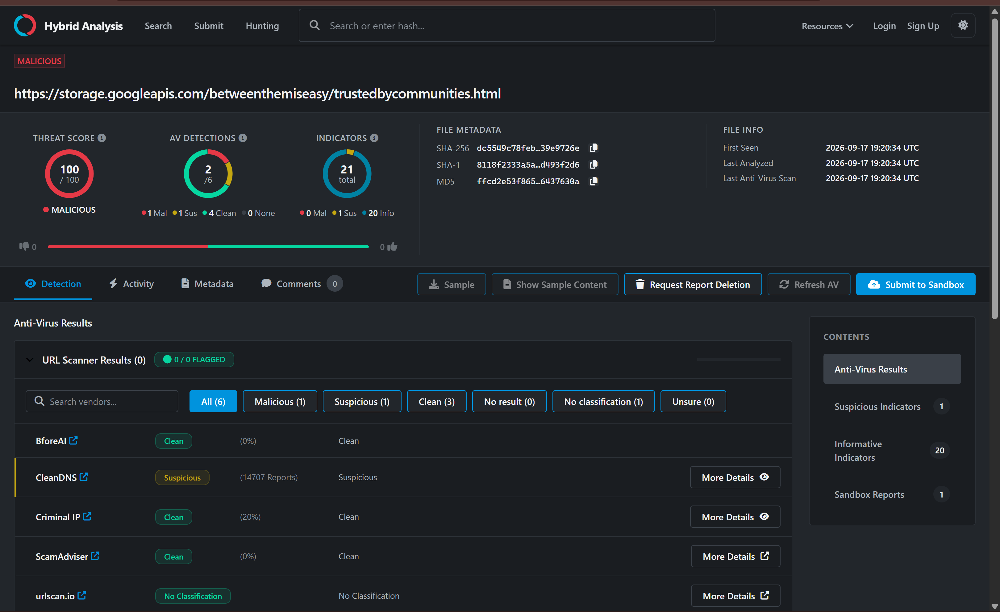

# Phishing-Sample-Analysis-Email-

## Objective
Analyze a genuine phishing email recovered from a spam folder, using the popular header/link/reputation methodology  but against real, active-campaign infrastructure. 

## Sample Source
Real phishing email, recovered from my Gmail's Spam folder. Subject: "Your photos and videos will be gone by end of day" — a fake cloud storage expiration/deletion notice.

## Step 1 — Header Analysis

| Field | Value | Assessment |
|---|---|---|
| **From** | `AccountSecurity—Cloud <ghxlwkqkifb@hcdbeuuui.port.55td.dophorepod.my.id>` | Sender domain is a randomly-generated subdomain on `.my.id` (a free Indonesian domain registrar commonly abused for disposable phishing infrastructure) |
| **To (header)** | `me@aol.com` | Does not match the actual recipient at all — a strong indicator of bulk/BCC spam where the visible `To:` field is a generic placeholder, not the real recipient |
| **Delivered-To / Envelope-To** | `kachipaul7@gmail.com` | The real delivery target — confirms the `To:` header was deliberately falsified/irrelevant |
| **Return-Path** | `<Return-jkupvqp@port.55td.dophorepod.my.id>` | Matches the From domain, but that domain itself is the disposable phishing infrastructure |
| **Received (sending server)** | Claims to be `icrasdev.ed.gov`, but the actual connecting server is `trbunnews.click` at IP `119.10.138.186` | **Critical finding:** the email attempts to spoof a `.gov` reverse-DNS hostname while the real sending domain is an unrelated `.click` domain — a deliberate impersonation attempt |
| **SPF** | `pass` | Passes only because it validates against the attacker's own disposable domain, which they fully control — this is not a  trust signal |
| **DKIM** | `pass` | Same caveat — signed by the attacker's own domain |
| **DMARC** | Not present in Authentication-Results | No DMARC policy exists for this disposable domain, meaning there's no enforcement mechanism catching this kind of abuse at the domain level |


## Step 2 — Link Analysis

**Decoded destination URL:**
```yaml
https://storage.googleapis.com/betweenthemiseasy/trustedbycommunities.html#4qbkqA232946IpGL3128rmrodptohu5256IRSEYZRKVPXCPSV301DDGY2063918T20
```

**Technique identified: trusted cloud infrastructure abuse.** The base domain, `storage.googleapis.com`, is genuinely Google's own infrastructure — used by millions of legitimate applications. The attacker uploaded phishing content to a Google Cloud Storage bucket they control, then links to it directly. This is a well-documented, real-world evasion technique: hosting malicious content on trusted cloud platforms (Google Cloud Storage, AWS S3, Azure Blob Storage) specifically defeats simple domain-reputation and blocklist-based defenses, since the base domain itself will never be flagged.

**Additional technique noted:** the long alphanumeric string after the `#` fragment is passed client-side only (browsers do not send URL fragments to the server), a pattern sometimes used by phishing kits to serve or personalize payload content only when loaded exactly as intended — making the same URL behave differently or appear inert to naive automated scanners versus a real targeted victim which played out nicely because Virustotal, Urlscan.io all gave a a clean verdict on the malicious URL.

## Step 3 — Content Analysis

- **Urgency:** "Your Files Will Be Deleted Today," "Last Chance," fabricated precise-sounding detail ("Storage used: 250GB / 250GB (100%)") designed to feel personalized despite being generic
- **Spam-filter evasion via hidden content:** the raw email source contains a massive `<div style="display:none">` block filled with unrelated garbled text — fragments of unrelated scientific writing, multiple entirely different fake "welcome" email templates (IBM Cloud, Wistia, Fastly, Parsec, a car rental loyalty program, YNAB, Podio), and randomized word lists. This is a classic technique for defeating Bayesian/statistical spam filters, which flag emails based on word-frequency patterns — stuffing irrelevant "normal" text dilutes the signal. This strongly suggests the email was generated by an automated bulk-phishing kit assembling content from multiple stolen/scraped templates, rather than a targeted, hand-crafted attack.

## Step 4 — Reputation Check

**VirusTotal:** result: **clean, no detections.**

**urlscan.io:** submitted the same URL — result: **no scan data / not found.**

**This null result is the most important and eye-catching analytical finding, although it looks like a  dead en, but it is not.**

1. **Trusted-domain effect:** `storage.googleapis.com` will never itself be flagged regardless of what's hosted at a given path, since the domain's overall reputation reflects legitimate Google infrastructure used at massive scale.
2. **Ephemeral infrastructure:** phishing content hosted on cloud storage buckets is often taken down quickly (by Google's abuse team or third-party reports), so by the time of my analysis   the specific malicious content is no longer live for a scanner to observe.


**Conclusion:** automated reputation and sandbox tools have genuine, well-understood blind spots against phishing that abuses trusted cloud infrastructure, is short-lived, or uses client-side-only payload delivery. A "clean" result from these tools should never be read as "confirmed safe" — it should be read as "not detected by this method," and weighed against the header forgery and content-based evidence gathered independently.



## Phishing Analysis Report

```yaml
Sender (From): AccountSecurity—Cloud <ghxlwkqkifb@hcdbeuuui.port.55td.dophorepod.my.id>
Return-Path: <Return-jkupvqp@port.55td.dophorepod.my.id> (matches From — disposable domain)
Reply-To: Not present
SPF/DKIM/DMARC Results: SPF=pass, DKIM=pass (both self-validated against attacker-controlled 
                         domain), DMARC=not present/not enforced
Suspicious Links: https://storage.googleapis.com/betweenthemiseasy/trustedbycommunities.html#...
                  (phishing content hosted on legitimate Google Cloud Storage infrastructure)
Attachment: None

Red Flags Identified:
  - To: header does not match actual recipient (bulk/BCC spam indicator)
  - Received header attempts to spoof a .gov reverse-DNS hostname while actually sending 
    from an unrelated .click domain
  - Sender domain is a randomly-generated, disposable subdomain (.my.id)
  - No DMARC policy on sending domain — no enforcement mechanism
  - Malicious content hosted on trusted cloud storage (Google Cloud Storage) specifically 
    to evade domain-reputation checks
  - Massive hidden-text block in the email body, consistent with automated spam-filter evasion
  - Urgency/scarcity manipulation ("deleted today," "100% storage used")
  - Reputation checks (VirusTotal, urlscan.io) returned clean/no-data — a known limitation 
    against this evasion technique, not evidence of safety
Verdict: Phishing (confirmed malicious via header forgery and content analysis, 
         despite some  inconclusive automated reputation results)


Recommended Action:
  - Do not click the link or enter credentials under any circumstances
  - Report to Google as phishing (both the email and, separately, report abuse of the 
    Google Cloud Storage bucket hosting the content)
  - Block the sending domain and the .click redirect domain at the email gateway level
  
```



 

## Tools Used
- Gmail ("Show original" header viewer)
- VirusTotal (URL reputation check — inconclusive)
- urlscan.io (URL sandbox scan — inconclusive)
- Hybridanalysis.com ( URL malware analysis and threat score - malware detected, DNS has over 14million reported reports online)
- Base64 decoding (manual, to extract the true HTML body and links)
